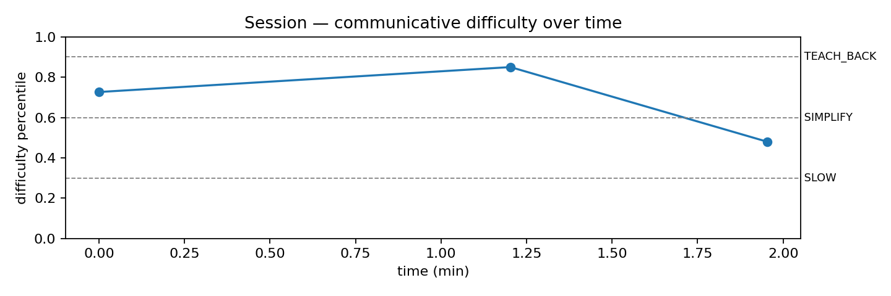

# Session report — communicative-difficulty agent (demonstrator)

- Turns: **3** · Reply brain: **gemini**
- Mean difficulty: **69th percentile** of clinical speech · Peak: **85th** 
- Adaptations triggered: **3/3** turns (SIMPLIFY×2, SLOW×1)
- Difficulty varied within the session -> evidence of a *state*, not a fixed speaker trait.

| # | you said | difficulty | pause | longest | tier | agent replied |
|---|---|---|---|---|---|---|
| 1 | uh, as I said, my day is like absolutely good and  | 73% | 28% | 2.1s | SIMPLIFY | That is a busy day! Did you go to the gym first, o |
| 2 | uh, yes, this is not too much busy, but, uh, I was | 85% | 36% | 4.4s | SIMPLIFY | It feels so good to have a great workout. Did you  |
| 3 | uh, I, uh, uh, I tried to lift the weights today a | 48% | 36% | 0.8s | SLOW | Lifting weights is good. You missed the cardio tod |

*Demonstrator only: model trained on clinical speech with weak labels; healthy speakers are out-of-domain; thresholds are demo defaults, not clinically validated.*